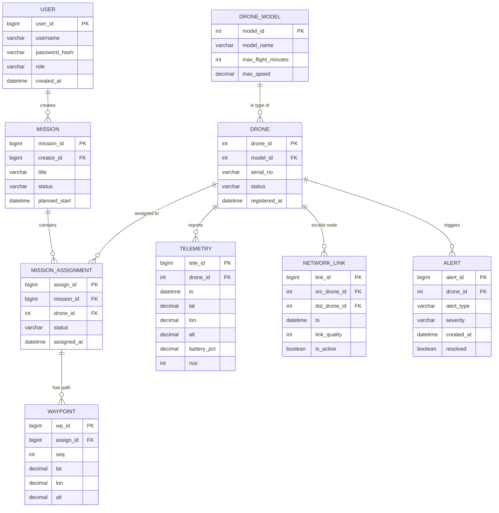

# 无人机自组网集群任务管理与遥测分析平台

> FANET Mission & Telemetry Platform
>
> 数据库课程设计项目 | 个人项目 | 创建日期：2026-05-31

---

## 0. 给接手 AI 的说明（务必先读）

本文件是项目的**总纲**，描述背景、目标、数据库设计、模块规划与开发流程。后续任何 AI 接手本项目时，请遵循以下约定：

- **技术栈固定**：Vue 3 + Spring Boot + MyBatis + Redis + **双数据库（TDengine + PostgreSQL，见第 2、4 节）**。不要擅自更换为其他框架。
- **数据库优先原则**：本项目核心是**数据库课设**，评分看重 SQL 功底。所有核心查询（抢占任务、拓扑递归、报表聚合）必须用 **MyBatis 手写裸 SQL**，禁止用 ORM 自动生成把 SQL 藏起来。
- **混合存储（polyglot persistence）是本项目的选型主张**：遥测/链路等**高频时序数据**进 **TDengine**（专用时序库，天然解决高频写入瓶颈）；用户、无人机、任务、告警等**关系/事务核心**进 **PostgreSQL**（保留行锁、递归 CTE、窗口函数、外键、触发器等关系型能力）。**全程不使用 MySQL**。
- **不得抄 GitHub 现成源码**：课程明确要求原创（可参考思路，代码自己写）。
- **加分项是重点**：AI 功能、压力测试与优化是评分加分项，优先保证这两块有产出。
- **"按数据特征选型"是本项目核心工程叙事**：时序数据与关系数据走不同的库，是这份课设区别于"一把梭单库"的高级看点，报告与答辩务必讲清为什么这样分（见第 2 节）。

---

## 1. 项目背景

### 1.1 真实需求来源

本人正在开发**嵌入式项目：无人机自组网（FANET, Flying Ad-hoc Network）**。多架无人机在没有固定基站的环境下，通过自组网相互通信、转发数据、协同执行任务。这类系统在实际运行中面临三个真实痛点：

1. **海量遥测数据无处沉淀**：每架无人机持续上报位置、电量、姿态、链路质量，数据量大、频率高，缺乏统一存储与分析手段。
2. **动态拓扑难以掌握**：自组网拓扑随飞行实时变化（谁能直连谁、谁给谁中继），地面操作员看不清网络全貌，失联节点难定位。
3. **任务调度容易冲突**：给无人机派发任务时，若无并发控制，同一架机可能被多个任务同时占用，导致执行混乱。

### 1.2 项目定位

本平台是该嵌入式无人机自组网项目的**地面指挥与数据分析后台**。它一端对接真实/模拟的无人机集群（通过 MQTT/HTTP 接收遥测），另一端为操作员提供**实时态势监控、任务调度、拓扑分析、数据复盘与 AI 智能分析**。

### 1.3 课程要求对照（评分锚点）

| 课程要求 | 本项目对应做法 | 类型 |
|---|---|---|
| 使用数据库系统 | **双库混合**：PostgreSQL 16 承载关系/事务核心；TDengine 3.x 承载遥测时序大表 | 必达 |
| 主流技术栈 Vue/SpringBoot/MyBatis/Redis | 全部用上，且每项都有真实用途 | 加分 |
| 解决实际生产/生活问题 | 无人机集群任务调度 + 遥测监控，真实研发需求 | 强叙事 |
| **按数据特征做存储选型** | 时序进 TDengine、关系进 PostgreSQL，讲清"为什么不一把梭单库" | **加分重点** |
| 接入 AI 功能 | 自然语言问数据库 / 遥测异常检测 / 续航预测 | **加分重点** |
| 功能测试 + 压力测试与优化 | 遥测高频写入压测 TDengine；关系查询 `EXPLAIN`/`EXPLAIN ANALYZE` 调优 | **加分重点** |
| 项目报告（E-R/关系模型/模块设计） | 关系实体丰富 + 时序超表建模，文档完整 | 必达 |
| 不得使用 GitHub 现成源码 | 全部原创，仅参考思路 | **硬约束** |
| 源码 + 3 分钟演示视频提交 | 自有 Git 仓库托管 | 必达 |

---

## 2. 数据库选型决策

### 2.1 决策原则（按数据特征分库）

> **时序数据进时序库，关系数据进关系库——用各自最擅长的引擎，而不是一把梭单库。**

本项目的数据天然分成两类，特征差异极大，因此采用**双库混合架构（polyglot persistence）**：

- **遥测时序数据（telemetry、network_links）→ TDengine 3.x。** 每架无人机持续高频上报位置/电量/姿态/链路，是典型的"写多、按时间和设备查、几乎不更新"的时序负载。TDengine 是专用时序数据库，"一个设备一张子表 + 超级表(STable)"的模型、列式存储、时间分区与自动数据保留，正好把方案最初识别出的"遥测高频写入吞吐"这个真实瓶颈在选型阶段就解决掉。
- **关系/事务核心（users、drone_models、drones、missions、mission_assignments、waypoints、alerts、audit_log）→ PostgreSQL 16。** 这些是强关系、强约束、需要事务的数据。PostgreSQL 原生支持**事务行锁 `SELECT ... FOR UPDATE`、递归 CTE `WITH RECURSIVE`、窗口函数 `RANK()/AVG() OVER`、外键、视图、触发器、存储过程**——也就是第 4.3 节那三段"必讲必写"的核心 SQL 的全部落点。

> **全程不使用 MySQL。** 关系核心固定用 PostgreSQL 16，时序固定用 TDengine 3.x。

### 2.2 为什么不是"纯 TDengine 单库"

TDengine 是优秀的时序库，但**不是通用关系库**：它没有跨表事务与行锁、不支持递归 CTE、不支持完整 SQL 窗口函数（只有 `INTERVAL` 时间窗）、不支持外键/触发器/存储过程。如果把任务调度、拓扑递归、报表统计也硬塞进 TDengine，第 4.3 节三段核心 SQL（行锁/递归/窗口）就无处安放，数据库课设最值钱的展示点会被掏空。因此关系核心必须由 PostgreSQL 承担——**这正是"按数据特征选型"的工程价值所在**。

### 2.3 两库职责边界（一句话记住）

| 数据 | 库 | 关键理由 | 数据库教学点 |
|---|---|---|---|
| 遥测 telemetry | **TDengine** | 高频写、时序查、自动保留 | 超表/子表、时间窗聚合、数据保留策略、压测 |
| 链路 network_links | **TDengine** | 带时间戳的边、随时间变化 | 时序建模；**拓扑递归在 PG 侧用最新快照做** |
| users / drones / missions 等 | **PostgreSQL** | 强关系、强约束、要事务 | 外键、行锁、递归 CTE、窗口函数、视图、触发器 |

> **跨库协作要点：** 大屏"最新链路快照"由后端从 TDengine 取最近一窗写入 Redis / PG 临时结构，**递归拓扑分析（第 4.3 节）在 PostgreSQL 上对最新链路快照做 `WITH RECURSIVE`**。两库通过应用层（Spring Boot）编排，不做跨库分布式事务（遥测写入与关系事务本就互不依赖）。

> **给接手 AI 的执行口径：** 关系核心一律 PostgreSQL，遥测/链路一律 TDengine，不要把两者混到同一个库。后端用两个独立数据源（两套连接池、两套 MyBatis 映射）。压测聚焦 TDengine 遥测写入吞吐；关系侧用 `EXPLAIN ANALYZE` 做查询调优。报告里把"为什么这样分库"讲成核心选型叙事。

---

## 3. 系统架构

### 3.1 总体架构图

```
┌─────────────────────────────────────────────────────────────┐
│  无人机集群（自组网 FANET）                                    │
│  Drone-1  Drone-2 ... Drone-N   ← 真实嵌入式端 / 遥测模拟器     │
└───────────────┬─────────────────────────────────────────────┘
                │ MQTT / HTTP 上报遥测（位置/电量/姿态/链路）
                ▼
┌─────────────────────────────────────────────────────────────┐
│  接入层：MQTT Broker (EMQX/Mosquitto)  +  遥测接入 API         │
└───────────────┬─────────────────────────────────────────────┘
                ▼
┌─────────────────────────────────────────────────────────────┐
│  后端：Spring Boot + MyBatis（双数据源）                       │
│  ├─ 遥测接入服务（批量写入 TDengine、削峰）                     │
│  ├─ 任务调度服务（PG 事务 + 行锁，防止任务冲突）                │
│  ├─ 拓扑分析服务（PG 递归 CTE 算多跳路径、检测网络分区）        │
│  ├─ 报表查询服务（PG 聚合/窗口函数）                           │
│  └─ AI 服务（自然语言转 SQL / 异常检测 / 续航预测）            │
└──────┬──────────────┬─────────────────────┬─────────────────┘
       │              │                     │
       ▼              ▼                     ▼
┌──────────────┐ ┌──────────────────┐ ┌──────────────────┐
│  Redis        │ │  PostgreSQL 16    │ │  TDengine 3.x     │
│  ├最新状态缓存 │ │ （关系/事务核心）  │ │ （遥测时序专库）   │
│  ├链路质量排行 │ │  ├核心业务表       │ │  ├遥测超表/子表    │
│  └WebSocket   │ │  ├视图/触发器      │ │  ├链路时序超表     │
│    Pub/Sub    │ │  ├行锁/递归CTE     │ │  └时间窗聚合       │
│              │ │  └窗口函数/存储过程 │ │    + 数据保留策略  │
└──────────────┘ └──────────────────┘ └──────────────────┘
       ▲
       │ WebSocket 实时推送
       ▼
┌─────────────────────────────────────────────────────────────┐
│  前端：Vue 3 + ECharts                                        │
│  ├─ 实时态势大屏（地图 + 无人机位置 + 拓扑连线）               │
│  ├─ 任务管理（下发/分配/状态跟踪）                            │
│  ├─ 遥测曲线（电量/信号/高度时序图）                          │
│  ├─ 报表分析（榜单/上座率/统计）                              │
│  └─ AI 问答框（自然语言查数据库）                            │
└─────────────────────────────────────────────────────────────┘
```

### 3.2 数据流向

1. **写入流**：无人机 → MQTT → 接入服务批量写 **TDengine 遥测超表**，同时更新 Redis 最新状态缓存。
2. **实时流**：Redis Pub/Sub → WebSocket → 前端大屏实时刷新。
3. **查询流**：前端 → 后端 → 热数据/最新状态读 Redis；遥测历史曲线/时间窗聚合查 **TDengine**；关系数据与报表查 **PostgreSQL**。
4. **分析流**：AI 服务读 TDengine 遥测历史 + PG 关系数据 → 异常检测/预测 → 写 **PG 的 `alerts` 表** → 推前端。
5. **拓扑流**：后端从 TDengine 取最近一窗链路快照 → 落 PG 临时/物化结构 → 在 **PostgreSQL** 上跑递归 CTE 算多跳路径与网络分区。

### 3.3 各技术的真实用途（避免"为用而用"）

- **TDengine 不是为了凑国产库**：遥测是"写多、按设备+时间查、几乎不改"的纯时序负载，用通用关系库扛高频写入会先到瓶颈。TDengine 的超表/子表模型、列存、时间分区与数据保留策略，是为这种负载量身定制的，直接把"高频写入吞吐"瓶颈在选型阶段解决。
- **PostgreSQL 承载关系核心**：任务调度行锁、自组网递归拓扑、运营报表窗口函数三类核心 SQL，以及外键、视图、触发器、存储过程，全部落在 PG。这是数据库课设 SQL 功底的集中展示面。
- **Redis 不是可有可无的摆设**：每架机最新状态高频读取（大屏每秒刷新），直接打数据库会压垮库；用 Redis 缓存最新状态 + Sorted Set 维护链路质量实时排行 + Pub/Sub 做推送，是真实必要的。
- **MyBatis 手写 SQL**：抢占任务、递归拓扑、报表聚合三类核心 SQL（PG 侧）全部手写 XML；TDengine 侧的遥测写入与时间窗聚合查询同样用 MyBatis 映射手写，**两个数据源各一套映射**，这是数据库课设的展示重点。
- **双数据源**：后端配置 PostgreSQL 与 TDengine 两套 `DataSource` + 连接池 + MyBatis `SqlSessionFactory`，按 Mapper 包路径区分，互不串库。

---

## 4. 数据库设计

### 4.1 E-R 概念模型（实体与关系）

核心实体与关系（用于报告里画 E-R 图，可直接用下方 Mermaid 渲染）：



### 4.2 关系模型（表清单）

### 4.2 关系模型（表清单）

> **分库标注：** 🟦 = PostgreSQL（关系/事务核心）；🟧 = TDengine（时序专库，以超表/子表建模）。

| 表 / 超表 | 库 | 作用 | 数据库教学点 |
|---|---|---|---|
| `users` | 🟦 PG | 操作员/管理员账号 | 基础实体、角色权限 |
| `drone_models` | 🟦 PG | 无人机型号（续航/速度等参数） | 字典表、外键 |
| `drones` | 🟦 PG | 无人机实例 | 状态机字段、外键 |
| `missions` | 🟦 PG | 任务（一次集群作业） | 主从关系 |
| `mission_assignments` | 🟦 PG | 任务-无人机分配（多对多桥表） | **多对多、事务行锁** |
| `waypoints` | 🟦 PG | 航点路径（一个分配多个航点） | 一对多、顺序字段 |
| `alerts` | 🟦 PG | 告警（异常检测产物） | 触发器生成、AI 写入 |
| `audit_log` | 🟦 PG | 审计日志 | 触发器自动写入 |
| `v_drone_latest` | 🟦 PG | 视图：每架机最新状态（关系侧字段） | 视图 |
| `telemetry`（超表） | 🟧 TDengine | 遥测时序数据 ★核心大表 | **超表/子表、列存、时间窗聚合、数据保留、压测** |
| `network_links`（超表） | 🟧 TDengine | 自组网链路时序（图的边，带时间戳） | **时序建模；最新快照导出后在 PG 做递归 CTE** |

> 关系表 9 张（含 1 视图）+ 时序超表 2 张，实体关系丰富，又有时序建模亮点，足够支撑一份完整的课程报告，且不至于做不完。

**TDengine 建模要点（报告需写清）：**
- `telemetry` 用**超级表（STable）**定义公共列（ts、lat、lon、alt、battery_pct、rssi）+ 标签列（`drone_id`、`model_id`），**每架无人机自动落到一张子表**，按设备天然分片、查询走标签过滤。
- `network_links` 同理建超表，标签为 `src_drone_id`、`dst_drone_id`，普通列为 `ts`、`link_quality`、`is_active`。
- TDengine 不设外键；`drone_id` 等通过**标签**与 PG 侧的 `drones.drone_id` 在应用层对齐（同一套设备编号）。
- 利用 TDengine **数据保留（`KEEP`）与按时间分片（`DURATION`）**自动管理过期遥测，替代原 MySQL 的 RANGE 分区 + DROP 分区方案。

### 4.3 核心 SQL 亮点（报告必写、答辩必讲）

> 这三段是数据库功底的集中展示，**全部在 PostgreSQL 16 上手写裸 SQL**（关系核心库）。语法以 PG 为准。

**(1) 任务调度防冲突——事务 + 行锁（PostgreSQL）**

给无人机派任务时，在一个事务里锁定候选机，确保"空闲且电量足够"才被占用，杜绝同一架机被两个任务抢。电量来自遥测，由接入服务实时回写 PG 的最新状态快照表 `drone_latest`（或视图 `v_drone_latest`），避免在事务里跨库查 TDengine。

```sql
BEGIN;
-- 锁定候选无人机行，别的事务必须排队等（PG 行级锁）
SELECT d.drone_id, d.status, dl.battery_pct AS battery
FROM drones d
JOIN drone_latest dl ON dl.drone_id = d.drone_id
WHERE d.drone_id = ? AND d.status = 'idle'
FOR UPDATE OF d;
-- 应用层校验：status='idle' 且 battery 足够，否则 ROLLBACK 报“无人机不可用”
UPDATE drones SET status = 'assigned' WHERE drone_id = ?;
INSERT INTO mission_assignments(mission_id, drone_id, status, assigned_at)
VALUES (?, ?, 'assigned', NOW());
COMMIT;
```

> **对照实验**：关掉 `FOR UPDATE`，用脚本模拟两个请求同时抢同一架机 → 复现冲突；加上 `FOR UPDATE` → 一成功一失败。报告里"问题→方案→验证"叙事最加分。
> **跨库说明**：`battery_pct` 的真值在 TDengine 遥测里，接入服务每次写遥测时把最新电量同步进 PG 的 `drone_latest`，使调度事务只在 PG 单库内完成，既保事务一致性又避免分布式事务。

**(2) 自组网多跳路径——递归 CTE（PostgreSQL）**

算某架无人机经过哪些中继节点连到地面站（drone_id = 0 视为地面站）。链路时序在 TDengine，分析前先把**最近一个时间窗的活跃链路快照**导入 PG 的 `network_links_snapshot` 表，再在 PG 上跑递归 CTE。

```sql
WITH RECURSIVE route AS (
    SELECT src_drone_id, dst_drone_id, 1 AS hops,
           CAST(dst_drone_id AS VARCHAR(200)) AS path
    FROM network_links_snapshot
    WHERE src_drone_id = ? AND is_active = TRUE
    UNION ALL
    SELECT nl.src_drone_id, nl.dst_drone_id, r.hops + 1,
           r.path || '->' || nl.dst_drone_id
    FROM network_links_snapshot nl
    JOIN route r ON nl.src_drone_id = r.dst_drone_id
    WHERE nl.is_active = TRUE AND r.hops < 10
)
SELECT * FROM route WHERE dst_drone_id = 0 ORDER BY hops LIMIT 1;
```

> **快照从哪来**：后端从 TDengine 用时间窗查询取每条链路的最新状态（见第 4.4 节示例），落入 PG `network_links_snapshot`。这一步本身就是"时序库出数据、关系库做图算法"的混合架构典型用法，报告里值得专门讲。

**(3) 运营报表——聚合 + 窗口函数（PostgreSQL）**

如各机任务完成数排名、平均链路质量、上线率等，用窗口函数 `RANK() OVER (...)`、`AVG(...) OVER (...)` 展示分析能力。任务/分配数据在 PG，可直接查；涉及遥测的指标（如平均电量）先从 TDengine 聚合出每机指标再 JOIN PG 维度表。

### 4.4 TDengine 时序查询亮点（报告需写、体现时序库能力）

TDengine 不做关系运算，但它的**时间窗聚合**是关系库做不好的强项，报告里作为"时序库专长"展示。

**(4) 遥测降采样 / 时间窗聚合（TDengine）**

每架机按 1 分钟窗口聚合平均电量与信号，供大屏曲线与 AI 趋势分析使用：

```sql
-- TDengine：INTERVAL 时间窗 + PARTITION BY 子表标签
SELECT drone_id,
       _wstart                AS win_start,
       AVG(battery_pct)       AS avg_batt,
       AVG(rssi)              AS avg_rssi,
       LAST(lat) AS lat, LAST(lon) AS lon
FROM telemetry
WHERE ts >= NOW - 1h
PARTITION BY drone_id
INTERVAL(1m);
```

**(5) 最新链路快照导出（TDengine → 供 PG 递归 CTE 用）**

```sql
-- TDengine：取最近窗口内每条链路的最新状态
SELECT src_drone_id, dst_drone_id,
       LAST(link_quality) AS link_quality,
       LAST(is_active)    AS is_active
FROM network_links
WHERE ts >= NOW - 30s
PARTITION BY src_drone_id, dst_drone_id;
```

> 后端把这两段 TDengine 查询结果分别用于大屏曲线、链路质量 Redis 排行、以及导入 PG 的 `network_links_snapshot` 给递归拓扑分析。**时序聚合在 TDengine、图递归在 PostgreSQL**，正是本项目分库选型的落地证明。

---

## 5. 功能模块规划

| 模块 | 子功能 | 涉及技术 | 优先级 |
|---|---|---|---|
| 用户与权限 | 登录、角色（管理员/操作员）、JWT 鉴权 | SpringBoot Security、**PG** | P0 |
| 无人机管理 | 型号字典、注册、状态查看 | CRUD、外键、**PG** | P0 |
| 遥测接入 | MQTT/HTTP 接收、批量入库、更新 Redis 缓存 | MQTT、批量写、**TDengine 超表** | P0 |
| 实时态势大屏 | 地图位置、拓扑连线图、状态卡片 | Vue+ECharts、WebSocket | P0 |
| 任务管理 | 任务创建、分配（事务防冲突）、状态跟踪、航点 | **PG 事务行锁** | P0 |
| 拓扑分析 | 多跳路径、网络分区检测、链路质量排行 | **PG 递归 CTE**、TDengine 取快照、Redis ZSet | P1 |
| 遥测分析 | 电量/信号/高度时序曲线、历史回放 | **TDengine 时间窗聚合**、降采样 | P1 |
| 报表统计 | 任务完成榜、上线率、消耗分析 | **PG 聚合/窗口函数** | P1 |
| 告警中心 | 异常告警列表、确认/处理 | **PG 触发器**、AI 写入 | P1 |
| AI 智能分析 | 自然语言问数据库 / 异常检测 / 续航预测 | 大模型 API、规则/轻模型、**双库 schema** | **P1 加分** |
| 系统管理 | 审计日志、数据保留维护、数据归档 | **PG 触发器/存储过程**、TDengine 保留策略 | P2 |

> P0 = 必做保底；P1 = 推荐（含加分项）；P2 = 时间充裕再做。

---

## 6. AI 功能设计（加分项重点）

按"性价比/演示效果"排序，建议至少做第 1 个，时间充裕再加第 2、3 个。

### 6.1 自然语言问数据库（NL2SQL）★首选

操作员输入"上周链路质量最差的是哪 3 架机"，系统调用大模型 API 把自然语言翻译成 SQL，执行后用 ECharts 出图。

- **双库路由**：本项目有两个库（PostgreSQL 关系核心 / TDengine 遥测时序），NL2SQL 需先**判定问题归属哪个库**再生成对应方言的 SQL。做法：把两套 schema（PG 表结构 + 字段注释、TDengine 超表结构 + 标签说明）都作为上下文喂给大模型，要求它先输出 `target_db: pg|tdengine`，再生成该库方言的 `SELECT`。
  - 关系/排名/任务统计类问题（"任务完成榜""上线率"）→ 路由到 **PostgreSQL**（可用窗口函数、JOIN）。
  - 时序/趋势/按时间聚合类问题（"上周链路质量趋势""近 1 小时平均电量"）→ 路由到 **TDengine**（用 `INTERVAL` 时间窗）。
- **实现要点**：约束模型只生成 `SELECT`，禁止 DML/DDL；生成的 SQL 先做白名单校验（表名/超表名白名单、禁止分号多语句、禁止写操作关键字）再执行；两个库各用**独立的只读账号**执行，防注入与越权。
- **演示效果**：极强，答辩现场输入问题即时出结果，还能顺势讲"为什么这个问题去了 PG、那个问题去了 TDengine"，把分库选型再强调一遍。
- **成本**：低，主要是 prompt 工程 + 两个只读数据库账号。

### 6.2 遥测异常检测

对电量骤降、GPS 漂移、姿态异常、链路质量突降做检测，自动写入 **PG 的 `alerts` 表**并推送大屏。

- **实现要点**：从 **TDengine** 用时间窗查询拉遥测序列，先用规则（阈值 + 滑动窗口）兜底，再叠加轻量模型（如 3-sigma / 孤立森林）。检测结果写 PG `alerts` 表，PG 触发器或服务层联动推送。
- **实用性**：高，是真实运维刚需。

### 6.3 续航/剩余飞行时间预测

基于历史电量放电曲线预测某架机还能飞多久，做预测性维护。

- **实现要点**：从 **TDengine** 取该机近期 `battery_pct` 时序（可先用 `INTERVAL` 降采样），做线性/多项式拟合或调用大模型分析趋势，输出预计可飞分钟数。

### 6.4 飞行后智能复盘报告（可选）

把一次任务的遥测摘要（TDengine 聚合）+ 告警（PG）喂给大模型，自动生成人话版任务复盘报告。

> **安全约束（给接手 AI）**：大模型 API Key 必须放环境变量，禁止硬编码进源码或提交到 Git。NL2SQL 对 **PostgreSQL 和 TDengine 各用一个只读账号** + SQL 白名单校验（表名/超表名白名单、只允许 `SELECT`、禁止多语句），绝不允许模型生成的 SQL 直接以高权限账号执行。

---

## 7. 测试与性能优化（加分项重点）

### 7.1 功能测试

- 后端：JUnit 5 + Mockito 对 Service 层做单元测试；对核心接口做集成测试。
- 重点测**任务调度并发**：用多线程/脚本模拟并发抢占同一架机，断言只有一个成功。
- 覆盖率目标 ≥ 80%（核心调度与查询逻辑必须覆盖）。

### 7.2 压力测试（核心加分点）

遥测高频写入是天然的压测场景，写入目标是 **TDengine 遥测超表**：

1. **工具**：JMeter 或 wrk，模拟 N 架无人机每秒上报遥测。
2. **指标**：写入 TPS、P95/P99 延迟、CPU/内存、TDengine 落盘与压缩比、后端连接池占用。
3. **场景**：逐步加压（10 → 50 → 100 → 200 → 500 架机），找到吞吐拐点。
4. **对照亮点**：把同一份遥测负载分别打到「通用关系库直插」与「TDengine 超表」做对比，用数据印证"时序数据该进时序库"这个选型主张——这是本项目最有说服力的压测叙事。

### 7.3 性能优化（报告"优化"章节）

| 优化手段 | 作用库 | 验证方式 |
|---|---|---|
| 关系查询加复合索引（如 `mission_assignments(drone_id)`、`alerts(drone_id, created_at)`） | PG | `EXPLAIN ANALYZE` 对比加索引前后执行计划 |
| 递归 CTE / 窗口查询调优（索引、物化快照） | PG | `EXPLAIN ANALYZE` 对比 |
| 遥测超表标签设计 + 时间分片（`DURATION`）+ 数据保留（`KEEP`） | TDengine | 对比分片裁剪前后查询耗时 |
| 遥测批量写入（攒批 + 多行 INSERT / 高效写接口） | TDengine | 对比单条 vs 批量的写入 TPS |
| Redis 缓存最新状态 | Redis | 对比直查数据库 vs 走缓存的 QPS |
| 后端连接池调优（HikariCP，PG 与 TDengine 各一套） | 双库 | 压测下连接等待时间变化 |
| 时序负载从通用库迁到 TDengine 的收益验证 | 跨库 | 同负载下两库写入 TPS / 延迟对比 |

> 报告里把"压测发现瓶颈 → 逐项优化 → 再压测对比"写成完整闭环，再叠加"通用库 vs TDengine 时序写入对比"，是优化章节的高分写法。本项目的分库本身就是优化结论的前置证据。

---

## 8. 开发计划（个人项目，时间充裕，分 7 个阶段）

| 阶段 | 内容 | 产出 |
|---|---|---|
| **S1 设计** | ER 图、关系模型、TDengine 超表建模、PG 建表 DDL、测试数据、技术架构图 | 数据库设计文档 + `schema_pg.sql` + `schema_tdengine.sql` |
| **S2 后端骨架** | Spring Boot + MyBatis 双数据源工程、用户鉴权、无人机/任务 CRUD | 可运行后端 + 基础接口 |
| **S3 遥测接入** | MQTT/HTTP 接入、批量写 TDengine、Redis 缓存、**遥测模拟器** | 数据能持续流入 |
| **S4 核心攻坚** | PG 任务调度事务行锁、PG 递归 CTE 拓扑分析、PG 报表聚合、TDengine 时间窗聚合 | 核心 SQL + 并发对照实验 |
| **S5 前端** | 实时态势大屏、任务管理、遥测曲线、报表页、WebSocket 推送 | 可视化界面 |
| **S6 AI + 压测** | NL2SQL 双库问答（+ 可选异常检测/续航预测）、JMeter 压测 TDengine 与调优 | AI 功能 + 压测报告 |
| **S7 收尾** | PG 触发器/存储过程、审计日志、完整报告、3 分钟演示视频、Git 提交 | 全部交付物 |

> 建议先把 S1–S4 跑通（项目骨架成立），再投入 S5 前端美化与 S6 加分项。S4 是最难也最值钱的部分，优先攻坚。

---

## 9. 交付物清单（对照课程要求）

- [ ] 源代码（前端 + 后端 + `schema_pg.sql` + `schema_tdengine.sql` + 遥测模拟器），托管在**自己的 Git 仓库**（非 fork 现成项目）。
- [ ] 项目报告：背景与需求分析、E-R 图、关系模型、**双库选型论证（为什么时序进 TDengine、关系进 PostgreSQL）**、模块设计、核心 SQL 说明、测试与压测报告、性能优化分析、AI 功能说明。
- [ ] 3 分钟演示视频：展示实时大屏、任务调度防冲突、拓扑分析、AI 问答、压测结果。
- [ ] README：环境搭建（PostgreSQL + TDengine + Redis）、启动步骤、依赖说明。

---

## 10. 给接手 AI 的下一步指令

接手本项目时，按以下顺序推进，每步产出后再进入下一步：

1. **先做 S1**：根据第 4 节，生成两份 DDL —— `schema_pg.sql`（PostgreSQL：9 张关系表/视图 + 索引 + 外键约束 + 视图 + 触发器 + 最新状态快照表 `drone_latest` + 链路快照表 `network_links_snapshot`）和 `schema_tdengine.sql`（TDengine：`telemetry`、`network_links` 两张超级表 + 标签设计 + 数据保留策略），并生成一批逼真的测试数据（无人机型号、无人机、若干历史任务，以及可灌入 TDengine 的历史遥测）。
2. 搭建 Spring Boot + MyBatis 后端骨架，配置 **双数据源**（PostgreSQL + TDengine）各自的连接池与 MyBatis 映射。
3. 实现遥测接入 + **遥测模拟器**（没有真实硬件时也能产生数据写入 TDengine，并作为压测数据源），同时回写 PG `drone_latest`。
4. **攻坚第 4.3 节核心 SQL**（PG 行锁 / PG 递归 CTE / PG 窗口函数）+ 第 4.4 节 TDengine 时间窗聚合，用 MyBatis XML 手写，并写并发对照实验脚本。
5. 实现 Vue 前端大屏与各功能页。
6. 接入 AI 功能（先做 NL2SQL，注意双库路由 + 双只读账号）。
7. 用 JMeter 压测 TDengine 遥测写入并按第 7.3 节优化，记录 `EXPLAIN ANALYZE`（PG）与写入 TPS 对比；可加做"通用库直插 vs TDengine 超表"的对照实验。

**全程约束**：核心 SQL 手写、不抄现成源码、密钥进环境变量、NL2SQL 双库只读 + 白名单、关系数据进 PostgreSQL、时序数据进 TDengine、不使用 MySQL、每个技术栈都要有真实用途。

---

*（文档结束。可直接交给 AI 接手，或作为课程报告初稿基础。）*


